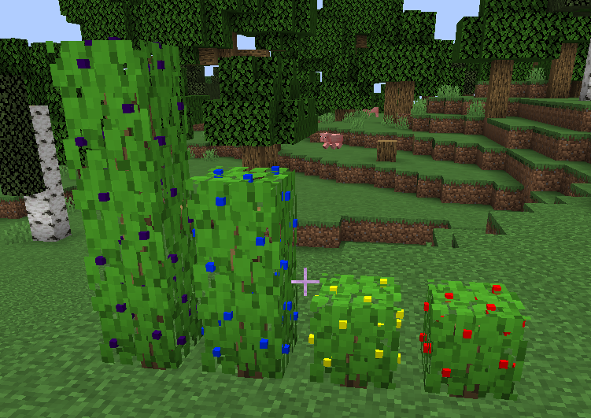
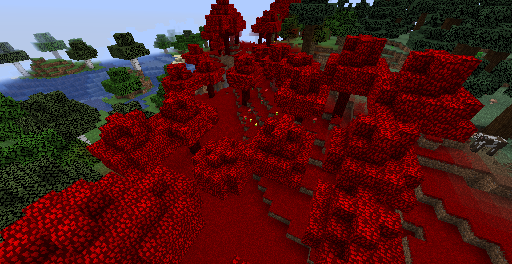
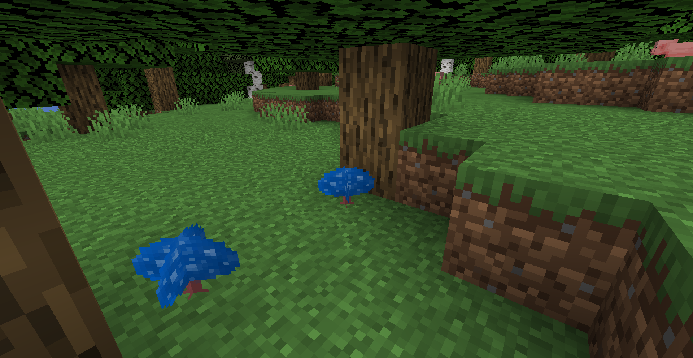
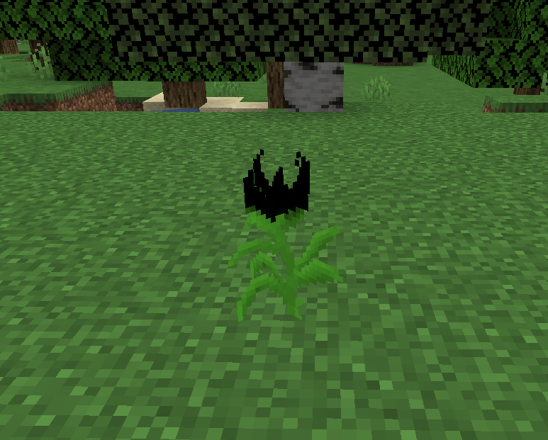
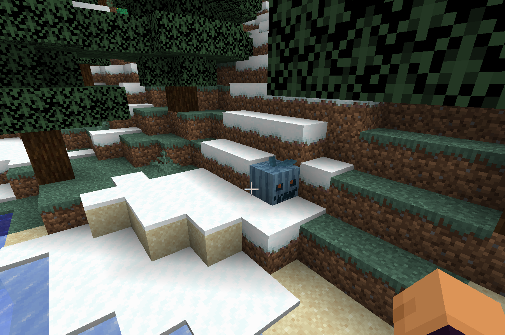
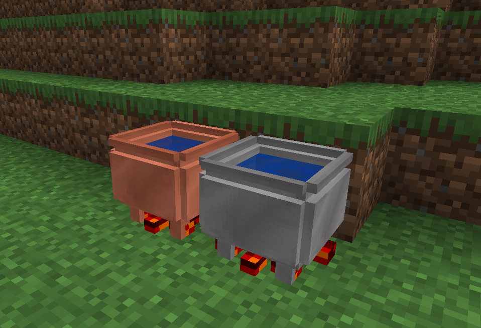
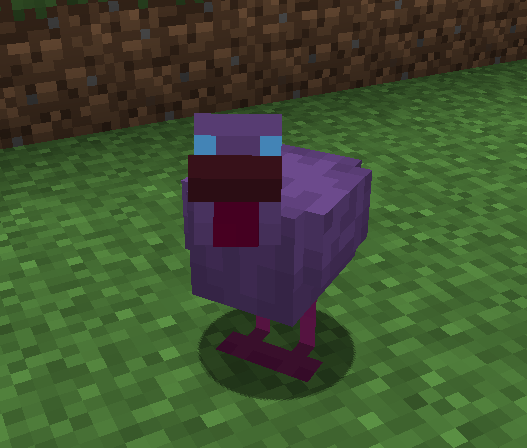

Introducing the Artent.Potions mod that allows to brew real potions from mostly common ingredients using cauldron. This mod uses an old idea of using cauldron to brew potions, but in it's own way and it's own potion effects.

## Core Features
- Expanded brewing capacity using mod cauldrons
- 18 custom potions
## New Custom Brews
Discover 17 new brews that expand gameplay possibilities:
#### Potions
1. Antidote
	- Removes any poison effect of same or lower level
2. Feather Falling
	- Removes fall damage
3. Lumberjack
	- Increases efficiency when breaking wood and leaves
4. Vampirism
	- Returns 10% per level when attacking living mobs
5. Holy Water
	- Adds 10% unblockable damage to undead mobs
	- Damages undead mobs and mobs with vampirism (cutting their effect duration) if thrown on them
6. Stone Skin
	- Decreases movement speed while increasing armor toughness
7. Liquid Flame
	- Makes all attacks to have additional 10% fire damage
8. Berserk
	- Increases Speed, Damage, Armor Toughness, Knockback, Knockback Resistance, Max Health by 30%. Adds recoil-effect that decreases every characteristic by 50%
9. Freezing
	- Decreases Speed, Damage, Block Break Speed, Jump Strength by 15%
10. Flight
	- Allows creative flight while effect is active
11. Fortune
	- Increases mob and block drop chances effectively adding Fortune/Luck enchantment on any item that you use
12. Mana (Artent.Staffs integration)
	- Regenerates mana

#### Concentrates
Concentrates are the potions that were fermented in a barrel for a long time, which caused their effect to change in some way

1. Surface Teleportation
	- Teleports user to the surface if it is less than 64\*level blocks away
2. Fermented Saturation
	- Fully restores hunger and saturation bars
3. Instant healing
	- Instantly heals 2 hearts
4. Flaming soul
	- Allows user to regenerate health by being on fire
5. Fermented Antidote
	- Removes any poison effect of potion level+1 or lower
6. Elder Vampire
	- Adds Bleeding effect to the attacked mob, which heals attacker in 3 block radius by 0.5
7. Angelic Water
	- Removes all negative effects
## WorldGen
#### Berries
Four types of berry bushes: blackberry, blueberry, cloudberry, raspberry

#### Crimson forest
Generates on the edge of some forests

#### Shroom
Rarely generates in forests, jungles and mushroom islands
Can be breed using bone meal

#### Shadowveil
Grassy plant spawning in forests and plains

#### Frost pumpkin
Generates in Taiga forest and cold plains

## Blocks
#### Cauldron
Used to brew potions. Fuel and water added by right-clicking the cauldron
Ingredients dropped into cauldron, which in turn changes color of water
When potion is ready it can be collected using phials
Each cauldron gives 3 potion phials

#### Barrel
Used to ferment potions
To ferment potion you need to prepare potion in cauldron, then use golden bucket to take potion from cauldron and place it into barrel
After some time potion will be fermented and have different effects
Only 7 potions can be fermented:
- Liquid Flame
- Regeneration -> Instant Healing
- Antidote
- Saturation
- Levitation - Surface Teleportation
- Holy water - Angelic Water
- Vampirism - Grand Vamprire
  

## Items
- Crimson Leaf and Crimson Berry - drops from Crimsonwood leaves
- Golden Bucket
- Phials
- Mana Feather - drop from Mana Chicken
- Acorn - drops from oak tree leaves
- Stone Scale - drops from tropical fish
- 
## Entities
#### Mana chicken
Created when shroom is given to normal chicken. Can be breed using shroom. Drops Mana Feathers but lays normal eggs
